W271 Lab 2: CO2 1997
================
Ken Trinh, Lisa Wu, Ray Cao, Sophie Yeh

## (3 points) Task 0a: Introduction

If you are concerned about global warming (or question whether this is
true), you may have heard about the “Keeling Curve” which is named after
the scientist Charles David Kneeling. Kneeling started measuring and
monitoring the accumulation of carbon dioxide
()
in the atmosphere in 1958. Many scientists credit the Keeling curve with
first bringing our attention to the current increase of

in the atmosphere. The one key question in people’s minds is whether the
CO2 increase trend observed in the past will continue and at what speed,
over the next few decades. The answer to this question is critical to
our policy makers and environmentalists, as the forecast

results will help them evaluate how concerned they should be and what
actions to take to minimize the consequences. We will conduct the study
of the

data set to answer this question. We plan to explore the data set and
modeling alternatives to determine whether a reliable forecast model can
be developed to forecast through the year of 2022.

## (3 points) Task 1a: CO2 data

The CO2 data was measured continuously at the Mauna Loa Observatory in
Hawaii from 1958 to the present day (the end of 1997). Prior to this
effort, measurements of

concentrations had been taken on an ad hoc basis at a variety of
locations. Keeling created a frequent and consistent measurement
framework of
.
Keeling and his collaborators measured the incoming ocean breeze above
the thermal inversion layer to minimize local contamination from
volcanic vents. The data were normalized to remove any influence from
local contamination. His work minimized the data noises due to
measurement errors or differences.

    ## [1] 0

    ## [1] 1959    1

    ## [1] 1997   12

This data set is a time series data that tracks

level (measured in part per million by volume (ppmv)) on a monthly
frequency.There are a total of 468 monthly observations from January
1958 to December 1997 with no missing data.

As you can see in @ref(fig:CO2-ETSDA), the

trend has steadily increased over time (close to a linear trend line),
although the annual growth rate seems to be range-bound (mostly +-5%)
with no clear trend.

is a greenhouse gas, so the increasing trend has significant
implications for global warming. From the histogram chart, we observed
that the

levels are not normally distributed, ranging from 310 to 370 ppmv. There
are no extreme outlines in this data set.

Furthermore, from the

Decomposition graph, we observed trend, season and irregular components
of the data set. Aside from the trend line discussed above, we observed
strong seasonality, and the remaining irregular effect.

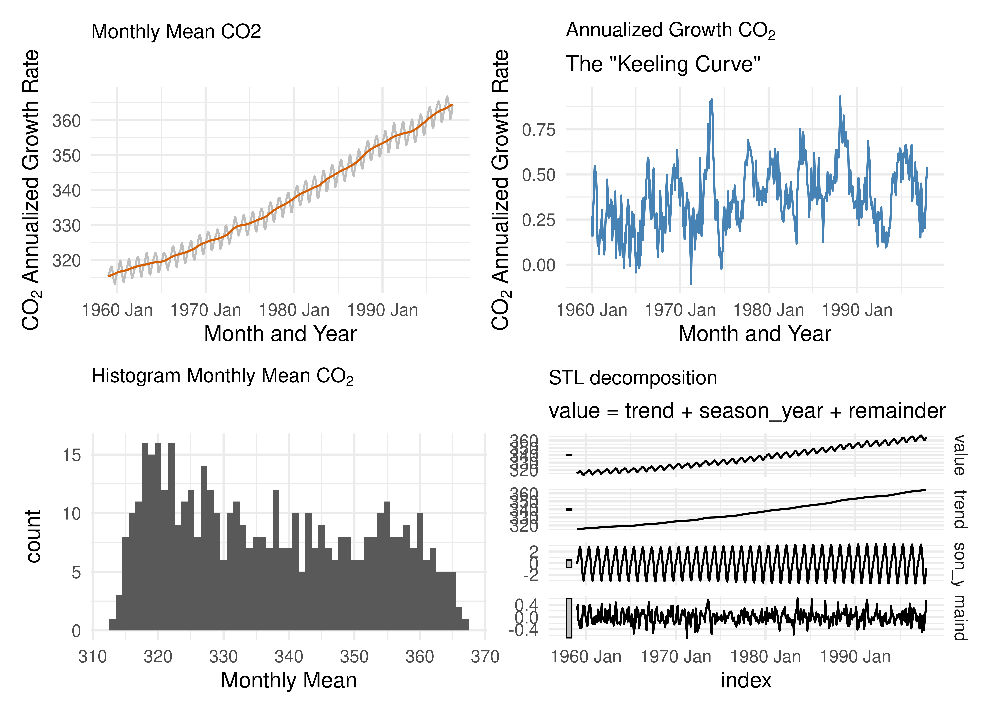

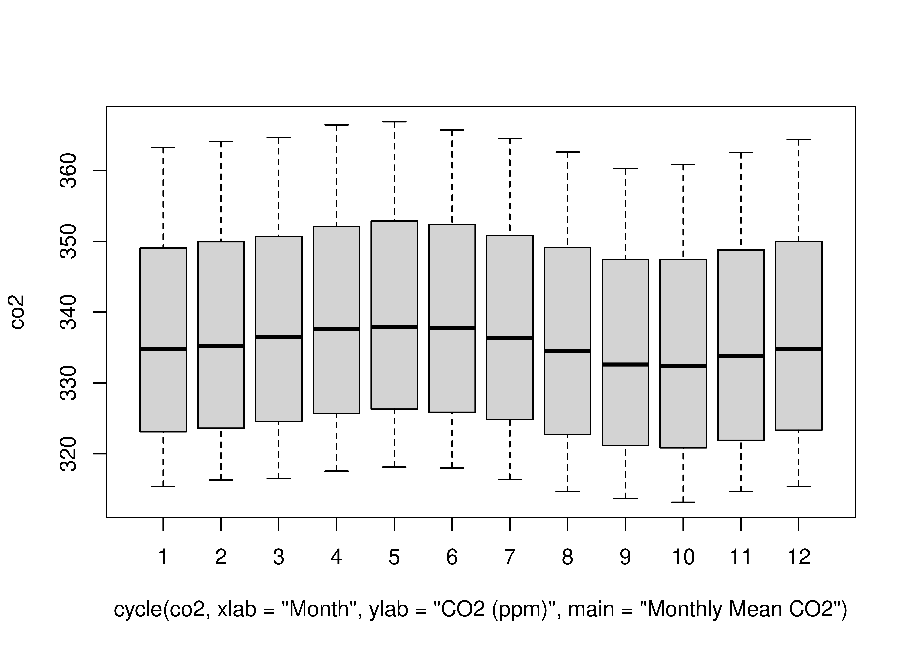

The boxplot in @ref(fig:boxplot) further validated the seasonal pattern
in the Decomposition graph. We observed April-June being the peak season
for
,
which aligns with more outdoor activities in the spring season.
September-October are the low points of the year. The difference between
the high and low averages is 5.5 ppmv.
(max(box![stats\[3,\])- min(box](https://latex.codecogs.com/png.image?%5Cdpi%7B110%7D&space;%5Cbg_white&space;stats%5B3%2C%5D%29-%20min%28box "stats[3,])- min(box")stats\[3,\])

``` r
# Discuss whether a logarithmic transformation of the data would be appropriate.
# Refer to LS7
par(mfrow = c(1, 2))
plot(log(co2), col = "blue")
plot(co2, col = "red")
```

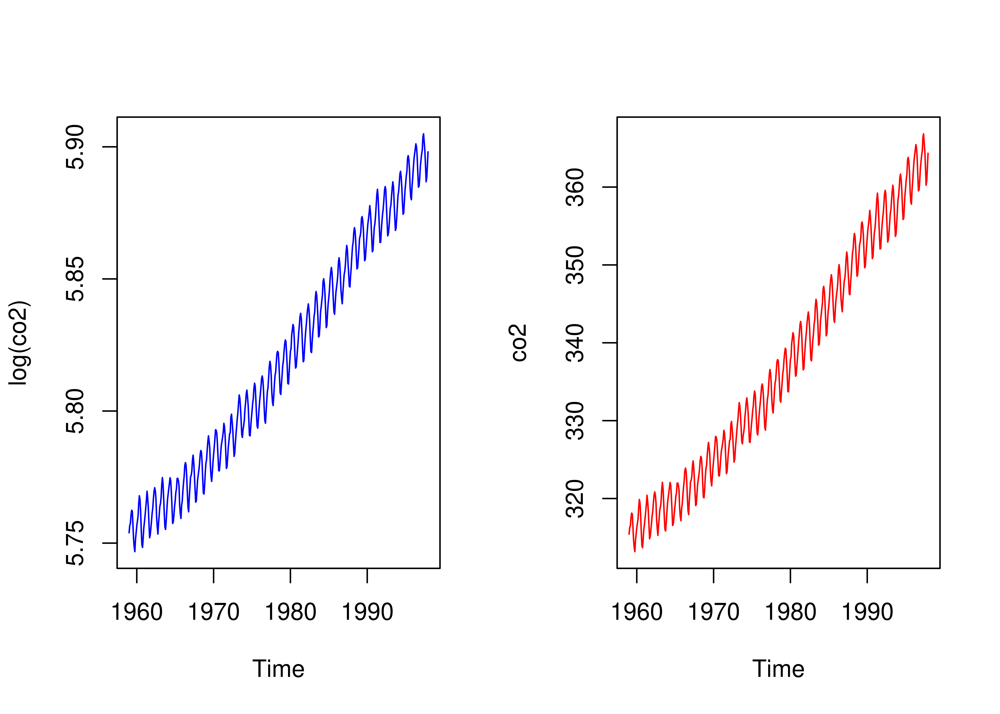

## (3 points) Task 2a: Linear time trend model

As discussed in the Data section above, the

time series data set follows closely to a linear trend line, so we will
first explore a linear regression model for the data set. Given the
annual growth rate has been range-bound (no clear sign of exponential
growth) and there are extreme small or large values, we don’t think it
is necessary to perform a logarithmic transformation of the data. A log
transformation may be more appropriate if the

level grows exponentially, which was not the case outline in both
@ref(fig:CO2-ETSDA) and @ref(fig:logarithmic-transformation). In these
plots, the seasonal variation does not seem to change over time, and the
trend does not have major curvature. Thus a logarithmic transformation
is not needed for this data set.

``` r
# Fit a linear time trend model examine the characteristics of the residuals
mod.lm1 <- lm(co2 ~ time(co2))
plot(mod.lm1, which = c(1, 1))
```

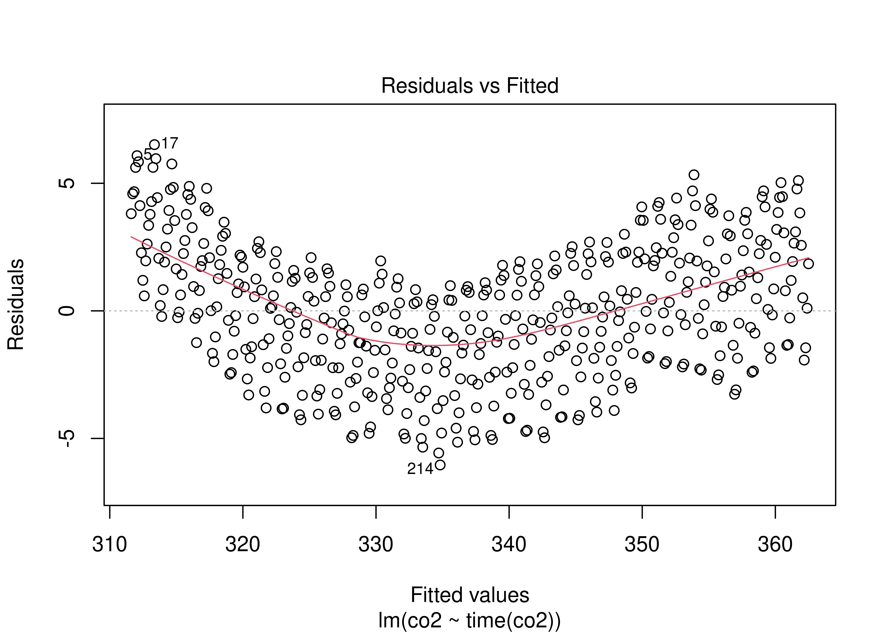

``` r
# quadratic time trend model.
mod.lm2 <- lm(co2 ~ time(co2) + I(time(co2)^2))
plot(mod.lm2, which = c(1, 1))
```

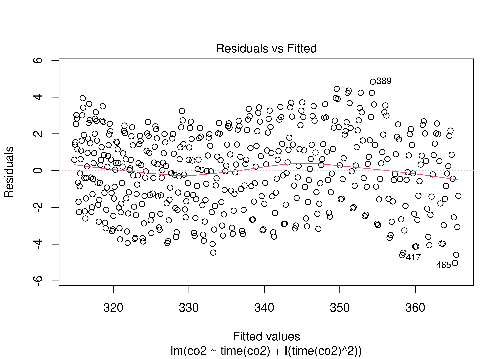

# Estimated Atmospheric CO2 Level

               Output Variable: CO2 Level in ppmv 
               -----------------------------------
                                                  
                      (1)               (2)       

|                                                                   |
|:------------------------------------------------------------------|
| linear time 1.307\*\*\* -49.191\*\*\* p = 0.000 p = 0.000         |
| quadratic time 0.013\*\*\* p = 0.000                              |
| (Intercept) -2,249.774\*\*\* 47,702.940\*\*\* p = 0.000 p = 0.000 |

Observations 468 468  
R2 0.969 0.979  
Adjusted R2 0.969 0.979  
================================================== Note: *p\<0.05;
**p\<0.01; ***p\<0.001

First, we evaluated a linear trend model using time as the explanatory
variable and

level as the response variable. Reported in
@ref(tab:linear-model-stargazer) This model has an intercept of x and a
positive slope of 1.3. Both coefficients are significantly different
than 0 statistically, with p-value less than 0.001. In our diagnostic
analysis of the model residuals @ref(fig:linear-effect-model), we noted
that the residuals line is curved, which violates the mean error
expectation. Variance increases as the fitted values increase, which
violates the homoskedasticity assumption of the classical linear model.
Clearly this simple model failed to sufficiently capture the data
characteristics.

We then evaluated the quadratic model by adding the quadratic term of
time. The coefficients are reported in @ref(tab:linear-model-stargazer)
and are statistically significant. The residual plot improves with less
curvature. Variance still shows some small level of heteroskedasticity
in @ref(fig:quadratic-effect-model). This model still does not
adequately capture the data characteristics.

``` r
# Fit a polynomial time trend model that incorporates seasonal dummy variables, and use this model to generate forecasts to the year 2020.

# function to be AIC and BIC scores
eval_results <- function(models) {
  # calculate from models
  aic_results <- lapply(models, function(model) AIC(model))
  bic_results <- lapply(models, function(model) BIC(model))
  # flatten list
  aic_results <- unlist(aic_results, recursive = TRUE, use.names = TRUE)
  bic_results <- unlist(bic_results, recursive = TRUE, use.names = TRUE)
  results <- data.frame(modelname = names(models), aic = aic_results, bic = bic_results)
  return(results)
}

# fine-tune polynomial model
# TODO: replace poly_season with dummy season variable - refer to LS7
# TODO: break up into two plots. Fix tdeg and change sdeg instead of doing all combinations.
models <- list()
for (tdeg in 1:5) {
  # for (sdeg in 1:5) {
    fit <- tslm(co2 ~ poly(trend, tdeg) + season)
    models[[paste(tdeg, sep = "_")]] <- fit
  # }
}

results <- eval_results(models)
# plot AIC/BIC of polynomial models
results %>%
  gather(key = "name", value = "value", aic, bic) %>%
  ggplot(aes(x = modelname, y = value, colour = name, group = name)) +
  geom_point() +
  geom_line() +
  xlab("Number of Parameters") +
  ylab("AIC/BIC")
```

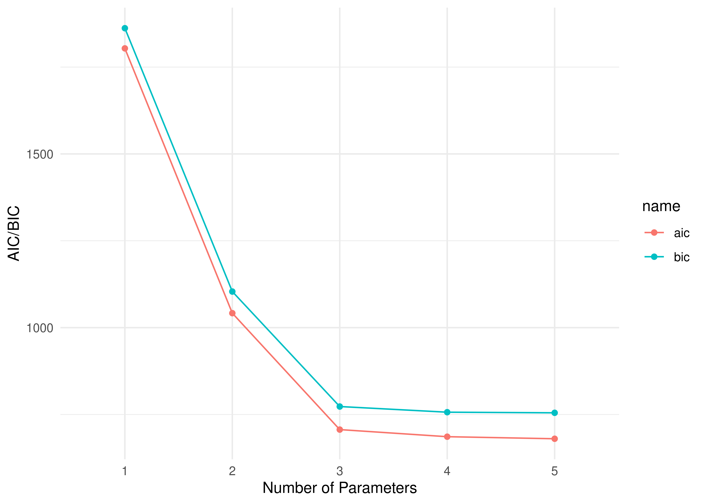

``` r
# based on graph, trend degree = 3 and season degree = 4 looks the best
```

Finally we will fit a polynomial time trend model and incorporate
seasonal dummy variables. We will use the goodness-of-fit infomration
criterion scores measurement to select the polynomial degree that
optimizes the model fit. The three goodness-of-fit assessment
measurements are AIC, AICc and BIC. Lower AIC, AICc and BIC indicates
better model performance. Generally, BIC has a larger penalty for models
with more parameters and therefore selects sparser models with fewer
parameters compared to AIC and AICc. AICc is the preferred method and
strikes the right balance of being stringent between AIC and BIC. We ran
both AIC and BIC assessments and displayed the result in
@ref(fig:polynomial-trend-seasonality).

It is noted that in our selection process we uses a range of 1 to 5
polynomial degrees for the trend variable and observed that 3 is the
optimal degree with the lowest AIC and BIC score. With this, we don’t
recommend trying higher polynomial degrees to avoid overfitting.

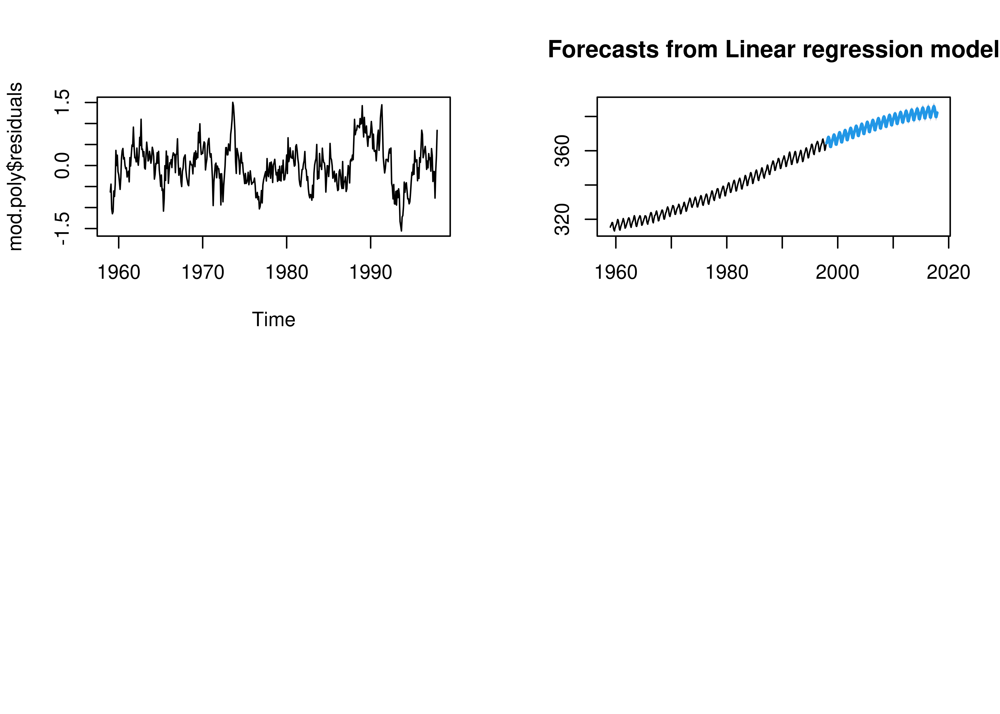
The model results, reported in @ref(tab:polynomial-model-stargazer),
show that all coefficients are significant, with p-value bellow 0.001.
There are no variables thrown out, which validates the assumption of no
perfect multicollinearity. In @ref(fig:polynomial-diagnostic-forecast),
we plot both the residuals and the forecasted CO2 level for 2020. Here,
the residuals in are hovering around zero, and variance does not show
significant changes over time (no strong evidence of violating
homoscedasticity assumption), which suggest that the estimated models is
stationary.

Using fitted polynomial model to forecast the

level through 2020 (@ref(fig:polynomial-diagnostic-forecast)). This
polynomial time trend with a seasonal dummy variable was able to capture
the linear and seasonal trend when forecasted to 2020. There’s a slight
curve at the 2020 tail of the trend due to the 3rd degree polynomial.

## (3 points) Task 3a: ARIMA times series model

> For the ARIMA model, we can conjecture the following parameters: p:
> the number of lag observations in the model, also known as the lag
> order. Inspect PACF plot. d: the number of times the raw observations
> are differenced; also known as the degree of differencing. q: the size
> of the moving average window, also known as the order of the moving
> average. ACF tells how many MA terms are required to remove any
> autocorrelation in the stationarized series.

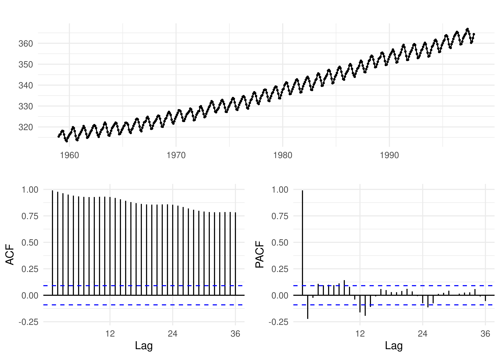<!-- -->

> The time series plot has a strong positive trend and is therefore
> non-stationary. The ACF plot has significant lags that persist with
> gradual decay and slight bumps due to seasonality. Applying
> differencing will remove this trend.

``` r
# 1st DIFFERENCING
diff(co2) %>% ggtsdisplay(main = "")
```

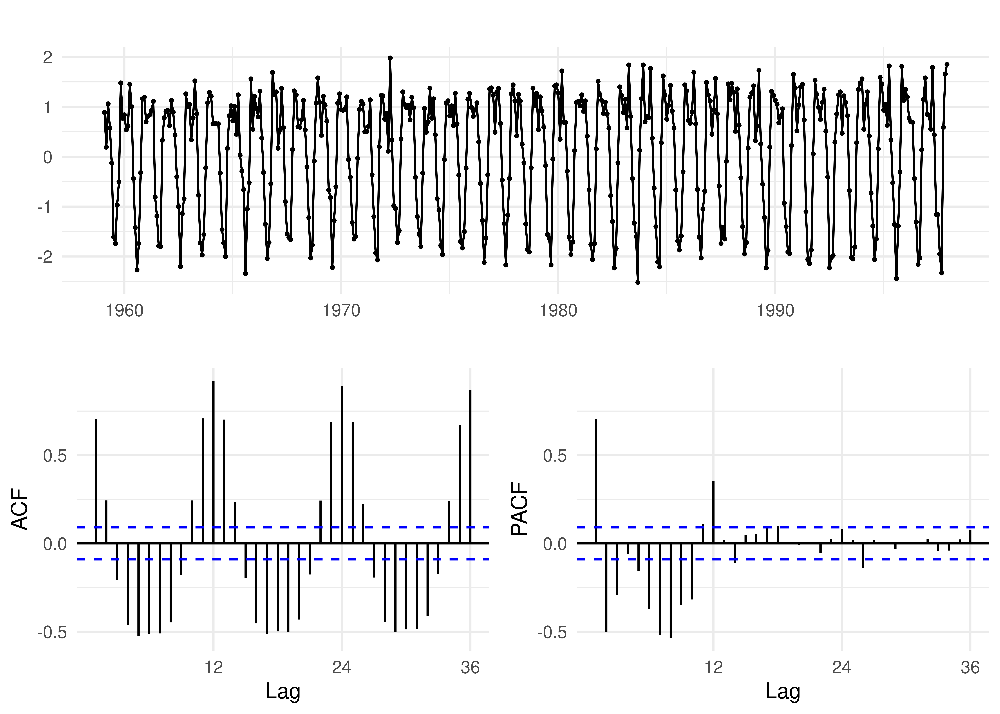<!-- -->

``` r
adf.test(diff(co2))
```

    ## Warning in adf.test(diff(co2)): p-value smaller than printed p-value

    ## 
    ##  Augmented Dickey-Fuller Test
    ## 
    ## data:  diff(co2)
    ## Dickey-Fuller = -30.38, Lag order = 7, p-value = 0.01
    ## alternative hypothesis: stationary

> After taking a first difference of the data, the time series plot
> appears to oscillate around 0 and the Augmented Dickey-Fuller test
> returns a significant p-value which confirms that the time series is
> stationary. the ACF has cyclic lags that are significant due to
> seasonality, but there are no signs of dampening. The PACF plot has 3
> to 11 leading significant lags until the autocorrelation dampen.
>
> # NOT SURE IF THIS AR LOGIC IS CORRECT.
>
> Because the ACF has persistent significant lags while the PACF has
> dampening oscillations, the data leans towards an AR(3) process. With
> the differencing component, the ARIMA(p,1,q) model will be the most
> appropriate. The correct MA and AR parameters will be tested.
>
> BIC will be the model selection criteria because BIC has a larger
> penalty for models with more parameters and therefore selects sparser
> models with fewer parameters compared to AIC and AICc.

``` r
# TODO - check order parameter, and add other necessary parameters
# TODO - how to manually determine arima parameters? - LS7
# AUTO ARIMA
mod.arima <- auto.arima(co2, 
                        d=1,
                        ic = 'bic',
                        trace=FALSE,
                        seasonal=TRUE)

summary(mod.arima)
```

    ## Series: co2 
    ## ARIMA(0,1,1)(1,1,2)[12] 
    ## 
    ## Coefficients:
    ##           ma1     sar1     sma1     sma2
    ##       -0.3482  -0.4986  -0.3155  -0.4641
    ## s.e.   0.0499   0.5282   0.5165   0.4367
    ## 
    ## sigma^2 = 0.08603:  log likelihood = -85.59
    ## AIC=181.18   AICc=181.32   BIC=201.78
    ## 
    ## Training set error measures:
    ##                      ME      RMSE       MAE         MPE       MAPE      MASE
    ## Training set 0.01538153 0.2879337 0.2299909 0.004479982 0.06834581 0.1816409
    ##                    ACF1
    ## Training set 0.02645309

``` r
checkresiduals(mod.arima)
```

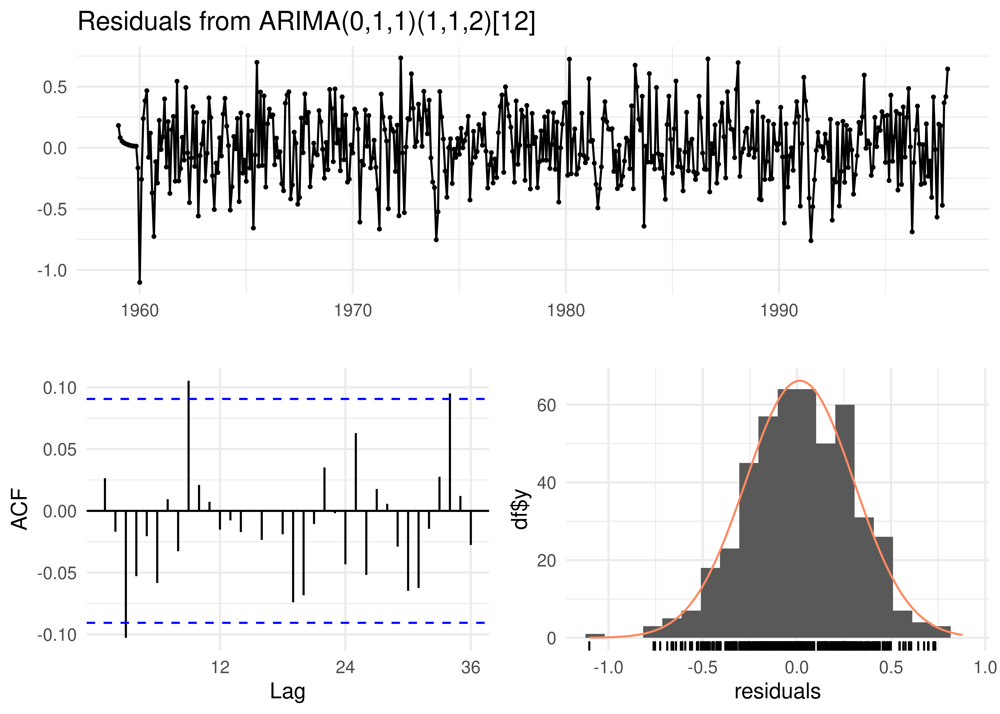<!-- -->

    ## 
    ##  Ljung-Box test
    ## 
    ## data:  Residuals from ARIMA(0,1,1)(1,1,2)[12]
    ## Q* = 21.999, df = 20, p-value = 0.3406
    ## 
    ## Model df: 4.   Total lags used: 24

``` r
arima_pred <- forecast::forecast(mod.arima, level = c(95), h = 22 * 12)
plot(arima_pred)
```

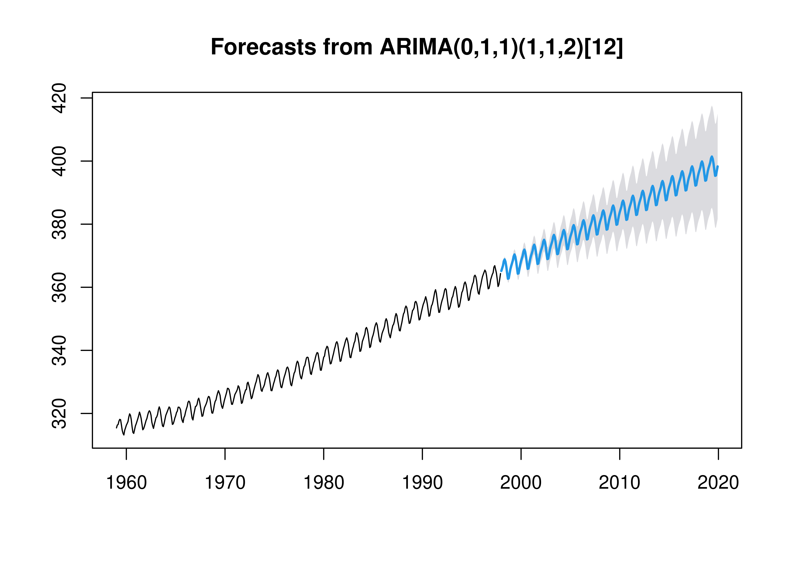<!-- -->

``` r
# SELF-DETERMINED parameters
# order <- c(1, 1, 2)
# mod.arima <- arima(co2, order = order, seasonal = list(order = order, period = NA))
# summary(mod.arima)
# arima_pred <- forecast::forecast(mod.arima, level = c(95), h = 22 * 12)
# plot(arima_pred)
```

> The final model is ARIMA(1,1,1)(1,1,2) with a BIC of 205.5. Checking
> the residuals of the model, the residuals plot oscillates around 0,
> the ACF autocorrelations are all below or only slighly over the
> threshold value, and the distribution is Gaussian. The Ljung-Box test
> returns a large p-value and therefore the residuals are stationary.
>
> Using this model, a forecast of CO2 concentrations to the year 2020
> was generated. After 2010, the forecast starts to curve with a wider
> confidence interval.

## (3 points) Task 4a: Forecast atmospheric CO2 growth

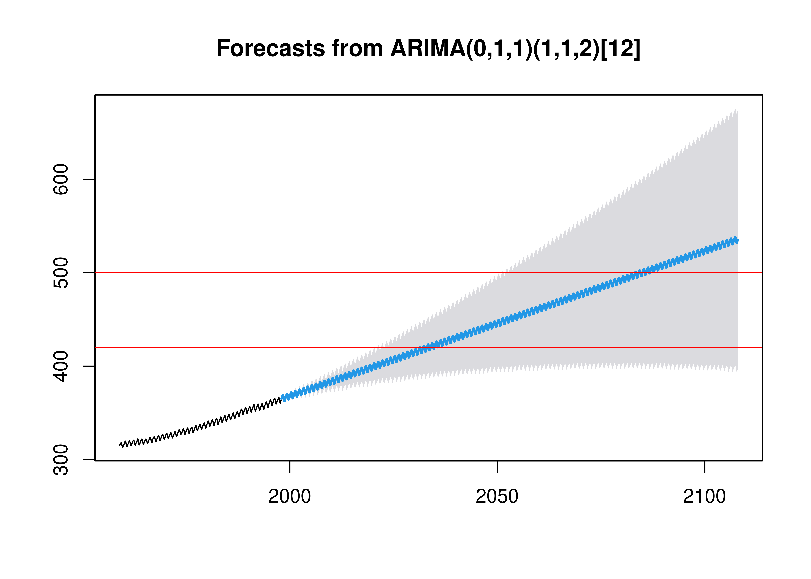<!-- -->

    ##          Point.Forecast    Lo.95    Hi.95
    ## May 2031       420.0598 392.3004 447.8192
    ## Oct 2086       499.4602 396.8727 602.0478
    ## Jan 2100       523.5351 398.8328 648.2374

> Based on the model forecasts, CO2 concentrations is expected to reach
> 420 ppm by May 2031 and 500 ppm by Oct 2086. By Jan 2100, CO2 levels
> will be at 523.5 ppm. We are not confident about these predictions
> because the lower bound of the confidence interval has plateaued at
> approximately 390 ppm while the upper bound continues to grow higher.

``` r
dcmp_multi <- co2_2 %>%
  model(stl = STL(log_value))

p_5_multi <- components(dcmp_multi) %>%
  as_tsibble() %>%
  autoplot(log_value, colour = "gray") +
  geom_line(aes(y = trend), colour = "#D55E00") +
  labs(
    y = TeX(r'(Log $CO_2$ Annualized Growth Rate)'),
    x = "Month and Year",
    title = "Monthly Mean CO2"
  ) +
  theme(plot.title = element_text(size = 10))

# plot the componentsco
p_6_multi <- components(dcmp_multi) %>%
  autoplot() + theme(plot.title = element_text(size = 10))

# plot ACF of residuals
p_7_multi <- components(dcmp_multi) %>%
  ACF(remainder) %>%
  autoplot() + labs(title = "ACF Residuals multiplicative decomposition") +
  theme(plot.title = element_text(size = 10))

# plot PACF of residuals
p_8_multi <- components(dcmp_multi) %>%
  PACF(remainder) %>%
  autoplot() + labs(title = "PACF Residuals multiplicative decomposition") +
  theme(plot.title = element_text(size = 10))

#(p_5_multi | p_6_multi) / (p_7_multi | p_8_multi)
```

> trend: strong positive linear trend across years irregular elements:
> The data oscilate around 0. From the ACF plot, residuals have strong
> autocorrelation terms, indicating trend and seasonal variation. The
> PACF plot ocilates with many significant lags seasonality: strong
> seasonality - will explore details in next plot
